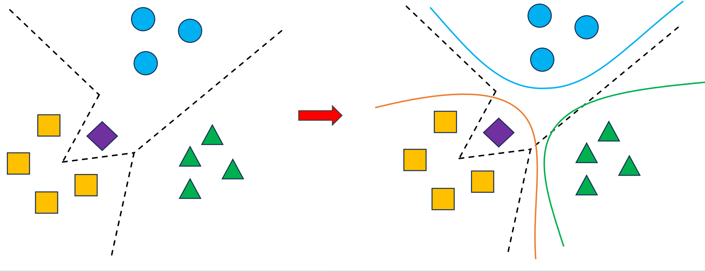
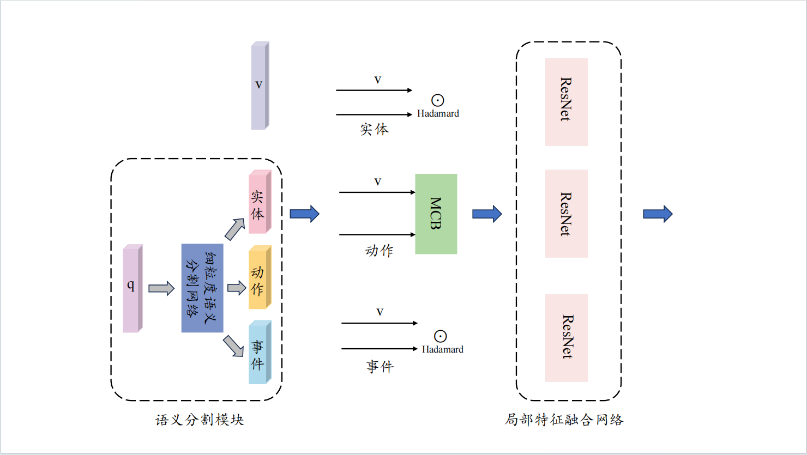

Action Is Important: Action Augmentation Video Moment Retrieval
=====
[Jiayu Song](https://cn.linkedin.com/in/jiayusong1999)

## Introduction
- Soft Contrastive Bilinear Video Moement Retrieval
- Action Augmentation Video Moment Retrieval


## Data
运行 prepare_data.sh 文件下载Charades和ActivityNet Captions数据集。
```bash
bash prepare_data.sh
```

## evaluate pre-trained models
为方便验证模型的有效性，预训练模型地址：[Baidu NetDisk](https://pan.baidu.com/s/1ydqOZ6qer6MdR14x6BwdDw) , 提取码：uky2 

将模型下载后放在pretained_models文件下。

- **Ablation Study & Hyperparameter Analysis** 
- 消融实验，超参数敏感性分析实验各模型，训练过程，测试结果均在其中，以 .txt和 .png文件存储。


## Multimodal Compact Bilinear Fusion in VMR
针对传统特征融合过程计算效率低，特征存储成本高且融合深度不足，从而使检索准确率下降这一问题，引入了双线性特征融合算法(Multimodal Compact Bilnear Fusion)来降低特征存储成本和提高特征融合深度，为提升视频检索准确性提供基础。

## Soft Contrastive Learning For VMR
为避免数据集中噪声数据和模型对单一数据集过度训练导致视频文本模态在特征映射和对齐过程中出现曲折尖锐的分类边界，本章节模型使用软对比损失来优化模型参数，帮助视频-文本样本对在映射和对齐的过程中，视频类特征，文本类特征和不相关视频类特征之间的边界变得平滑，从而有效地帮助模型完成特征对齐。


## Action Augmentation Block
动作增强模块主要由三个模块组成，如图所示，细粒度语义分割模块，分体融合模块和局部特征融合网络。首先文本特征经细粒度语义分割网络划分为“实体”，“动作”和“事件”三个部分，然后按照 Hadmard，MCB 和Hadmard 的顺序，各部分语义向量分别与视频特征向量进行分体融合，最后经由局部特征融合网络完成初步的局部融合。整体的文本语义处理过程按照“提取-分割-融合”的过程完成，之所以选择先完成特征提取再进行语义分割，而不是先对文本做分词操作再对词组进行特征提取，是因为“分割-提取”会破坏模型对文本上下文的关联掌握，导致模型对文本语义理解不连贯，从而影响模型的特征融合效果和视频片段检索性能。



## Code
The framework of AGVMR is based on [LGI](https://github.com/JonghwanMun/LGI4temporalgrounding). On the basic of it, add MCB block, action augmentation block, soft contrastive Loss (for SCBVMR) and mean square loss (for AGVMR) to improve the accuary of vmr. Many thanks for their open source and we have cited their paper in our work. 

## Train

##### ActivityNet Captions
```bash
bash scripts/train_model.sh AGVMR ag anet 0 4 0
```
##### Charades-STA
```bash
bash scripts/train_model.sh AGVMR ag charades 0 4 0
```

## Test

##### ActivityNet Captions
测试AGVMR模型在ActivityNet Captions数据集上的检索效果，可使用下述命令：
```bash
CUDA_VISIBLE_DEVICES=0 python -m src.experiment.eval \
                     --config pretrained_models/anet/config.yml \
                     --checkpoint pretrained_models/anet/best.pkl \
                     --method ag \
                     --dataset anet
```

##### Charades-STA
测试AGVMR模型在Charades-STA数据集上的检索效果，可使用下述命令：
```bash
CUDA_VISIBLE_DEVICES=0 python -m src.experiment.eval \
                     --config pretrained_models/charades/config.yml \
                     --checkpoint pretrained_models/charades/best.pkl \
                     --method ag \
                     --dataset charades
```

